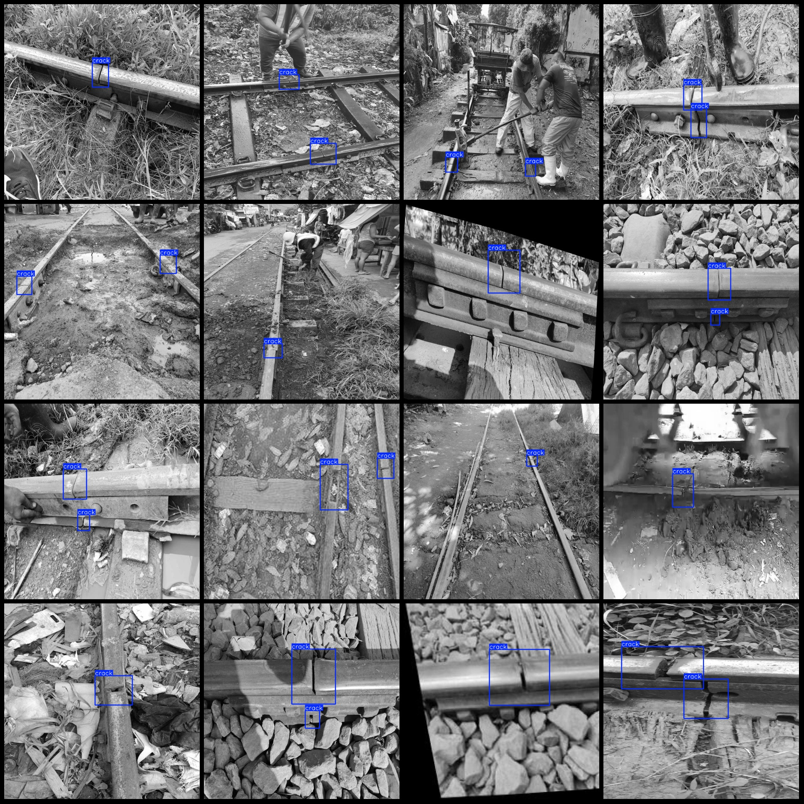
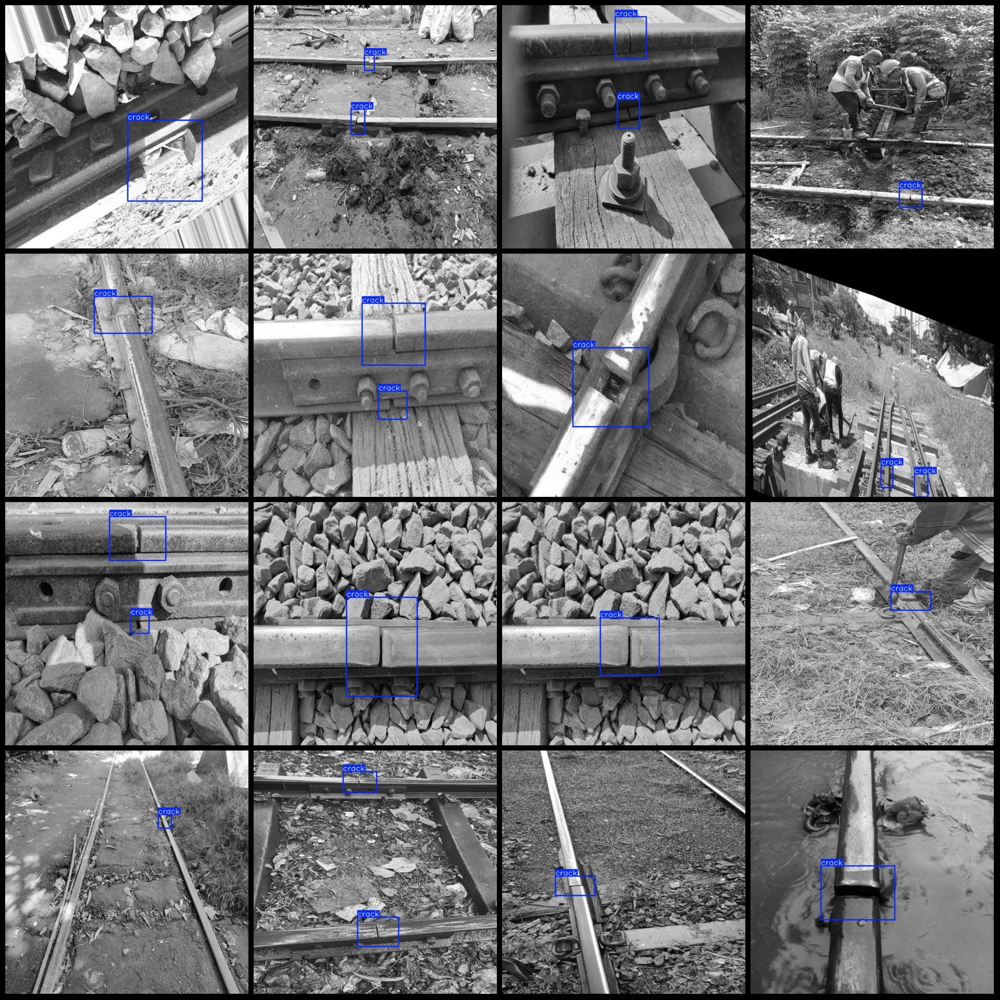

# Intelligent Transportation: Smart Pavement and Railway Fault Detection Dataset - VOC+YOLO Format, 698 Images, 1 Category

The dataset format: Pascal VOC format + YOLO format (without split path in txt file, only containing jpg images and corresponding VOC format xml files and yolo format txt files)

Number of images (jpg file count): 698
Number of annotations (xml file count): 698
Number of annotations (txt file count): 698
Number of categories: 1
Annotation category name: ["crack"]
Number of bounding boxes per category:
crack = 935
Total bounding boxes = 935
Image resolution: 640x640
Using annotation tool: labelImg
Annotation rules: Drawing a rectangular box for categories
Important note: No specific instructions provided at this time.
Special declaration: This dataset does not guarantee the accuracy of the trained models or weight files.

Image preview:
Annotation example:
## Image

Here is a pay link on Stripe ( https://buy.stripe.com/3cs8yP7sY87d0vu9AB ). Please contact me lonlonago@foxmail.com after funding $89, and I will send you a complete data files , thank you!

